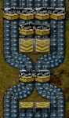
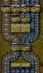
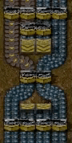
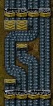
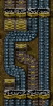
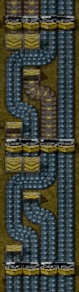
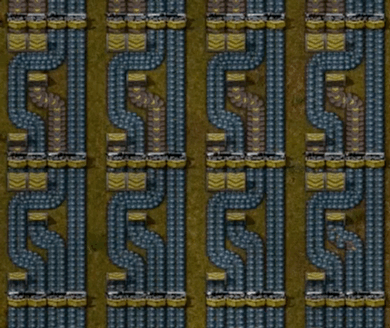
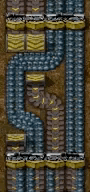
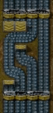

# The mechanics of multi-belt balancers

Recently while playing Factorio I ended up building a fairly large mega-base which had a need for large scale multi-belt balancers and I decided to go down the rabbit hole of building my own. There are a lot of blueprints for various multi-belt balancers and many discussions about the properties of multi-belt balancers but I never found a complete explanation of how they worked. This is my attempt to bring all of these things together and demystify the workings of the most ocmmon types of multi-belt balancers.


## What is a balancer?

Anyone who has played Factorio for any length of time is familiar with the simplest form of multi-belt balancer, the Splitter.

The splitter is most often used for what its name says, splitting one belt of input into two belts of equal output, effectively splitting the input into two halves.
```
input    ||
Splitter -----
output   || ||
```

However, the Splitter is actually more versatile than its name would suggest. A Splitter can also do the reverse, combining.
```
input    || ||
Splitter -----
output   ||
```

Since a Splitter has two inputs as well as two outputs, you can feed two belts of input into it and get one belt of output, reversing the normal usage.

Taking this to its logical conclusion, if you feed belts into both of the inputs and connect belts to both of the outputs, you are first combining the inputs then splitting to the outputs, leaving you with two balanced belts.
```
input    || ||
Splitter -----
output   || ||
```

So a better name for the Splitter might be a Two-Belt Balancer.

This is the simplest form of a multi-belt balancer, the one which Factorio has given us and also the basic building block of any larger multi-belt balancer.

Multi-belt balancers at their simplest form take the same number of inputs as they have outputs and don't worry about backups or blocked outputs. We'll touch more on this later, but for now let's just assume that all belts are flowing freely.

(Note that when this post is treating belts as a single unit even though every belt has two lanes within it which are distinct and separate. The Splitter, on its own, will never mix the contents of the left lane of a belt with the right lane of a belt. Any item on the left lane will always stay in the left lane, no metter how many splitters it goes through. The logic that a Splitter uses to decide which output something will go to is fairly complex, though, and gets even more so when you have more than one type of item on a belt. For purposes of simplicity, let's just assume that we have only one item on our belts and take it as given that the Splitter will always give you an equal number of items on each of its 2 output belts.)


### Formal definition

Now that we understand the hubmle Splitter we have enough to give a simple defintion for a multi-belt balancer.

A multi-belt balancer will take any number of inputs and divide the items from the inputs equally among any number of outputs.

This may seem simplistic and obvious but it lets us make some conclusions about larger belt balancers down the road.


## What does this mean when building a multi-belt balancer?

When building a multi-belt balancer you need to keep the basic definition in mind and make sure that your inputs are averaged across all of your outputs. This is actually comparable to doing a simple number average. For a two-belt balancer you could notate it like this:

```
inputs   A  B
Splitter ----
outputs  C  C
```

A is the left input lane and B is the right input lane. Both of the output lanes have the same amount on them, so they're both C. The equasion for what is on each output belt is then:
`C = (A + B) / 2`
which is just an average of two numbers.


### The four-belt balancer

Let's look at a four-belt balancer

```
inputs   A  B  C  D
balancer ----------
outputs  E  E  E  E
```

Calculating `E` as `(A + B + C + D) / 4` is simple, but how do we build the balancer itself? Since Factorio gives us the two-belt balancer we need to break the problem down in such a way as to make it a combination of two-belt balancers.

Thinking of this as an average of numbers we can easily break this down into two-number averages.

```
inputs    A  B  C  D
Splitters ----  ----
outputs   F  F  G  G
```

So `F = (A + B) / 2` and `G = (C + D) / 2`. Calculating the final result, `E`, as an average of two numbers is easy: `E = (F + G) / 2`. This leads to a simple idea, then, all we need to do is get one of the F outputs and one of the G outputs into a two-belt splitter and we'll have two belts with E as their output.

```
inputs    A  B  C  D
Splitters ----  ----
          F  F  G  G
Splitter     ----
outputs      E  E
```

That works for half of our 4 output belts, now we need to get the other 2 into a Splitter.

```
inputs    A  B  C  D
Splitters ----  ----
          F  F  G  G
Splitter  |  ----  |
outputs   |  E  E  |
          \        /
           \      /
            \    /
             ----
             E  E
```

That's it, we've now broken down a four-belt balancer into four discrete two-belt balancers. All that's left now is to route those output belts so that we can use them all.

```
inputs        A  B  C  D
Splitters     ----  ----
              F  F  G  G
Splitter      |  ----  |
              \  E  E  /
Undergrounds   \ v  v /
                \    /
Splitter         ----
                /    \
Undergrounds   / v  v \
              /  |  |  \
outputs       E  E  E  E
```

This should look familiar if you've ever used what has become the standard four-belt balancer in the Factorio community. Some blueprints add two more Splitters on the bottom but this isn't needed just to average the inputs to the outputs. (More on this later.)

This first step from Splitter to four-belt balancer may seem simple but it can be used as a blueprint for all larger belt balancers (as long as the number of inputs is equal to the number of outputs and the number of inputs is a power of two, or twice the size of the next smallest balancer).


## 8x8 Belt Balancer

Let's take a look at the beginning of an 8x8 belt balancer. We start with 2 4x4 balancers.

```
inputs        A  B  C  D  E  F  G  H
Splitters     ----  ----  ----  ----
Splitter      |  ----  |  |  ----  |
              \  I  I  /  \  J  J  /
Undergrounds   \ v  v /    \ v  v /
                \    /      \    /
Splitter         ----        ----
                /    \      /    \
Undergrounds   / v  v \    / v  v \
              /  |  |  \  /  |  |  \
              I  I  I  I  J  J  J  J
```

Now, you could stick another 4x4 belt balancer on the bottom in the middle and it would balance two I and two J belts to get you the eventual balanced output, K, but it's not really needed. The first two Splitters on a 4x4 balancer wouldn't actually be doing anything since putting two I belts into a Splitter would just give you two I outputs again.

All we really need to do is take one I and one J belt and put them through a Splitter

```
inputs        A  B  C  D  E  F  G  H
Splitters     ----  ----  ----  ----
Splitter      |  ----  |  |  ----  |
              \  I  I  /  \  J  J  /
Undergrounds   \ v  v /    \ v  v /
                \    /      \    /
Splitter         ----        ----
                /    \      /    \
Undergrounds   / v  v \    / v  v \
              /  |  |  \  /  |  |  \
              I  I  I  I  J  J  J  J
Splitter               ----
                       K  K
```

Now we have two belts with the final balanced output, K. To get the rest balanced all we have to do is take each remaining pair of I and J belts and send them through a Splitter.


## Generizing the pattern

Now we know what the basic pattern is when building the next size of balancer. Start with two of the previous size of balancers and the outputs of those two balancers are now balanced for each half of the belts. Now you just have to take one belt from the left and one from the right and run them through a Splitter to get two of the final balanced belts. Keep doing this with the rest of the belts and you have the next size of balancer. I've found that up to an 8x8 balancer there is some manual routing that needs to be done to get the belts into the right places as the size is more limited, but from 16x16 and up you can reuse the basic blueprint in multiple stages to get the output belts of the two smaller balancers interleaved to send them through a set of Splitters to get the final balanced output.


## Throughput of Balancers

Earlier I mentioned that for the initial designs we were assuming that all belts were flowing freely. This is because these balancer designs do not work as you might expect if some outputs are blocked and only some inputs are being fed. Some sets of outputs and inputs will work fine, but others will only get partial throughput.

### Partial Throughput

Consider the 4x4 balancer we discussed above. When all inputs and outputs are flowing there is no problem.



But when only the right 2 input belts are flowing and only the leftmost and rightmost outputs belts are flowing, we only get half a belt of output on each of the two flowing output belts despite having two full belts for input.



This happens because the two outer output belts are only fed by a single full belt in this instance. The problem is easily fixed by adding two more balancers to the bottom.



What this means when dealing with larger balancers, though, is not obvious with this design. Let's look at an alternate 4-belt balancer which has the Splitters on either end instead of having two in the middle.



As you can see, this design also has full throughput with all four belt flowing freely. It works by just swapping the two center belts before the final two Splitters.

This design still has the same issue with throughput, but with a different combination of inputs and outputs.



The problem is easier to see now, though, since just the one belt on the right is feeding the two flowing output belts through the second right-hand Splitter. For this design, adding two Splitters at the end would do nothing since there are already two Splitters at the end.

### Full Throughput

It turns out the solution is to put two os these 4x4 balancers in series, feeding the output of the first into the input of the second.



Now we have two full output belts. Just to prove that this works for all combinations of outputs, here's all 4 of those:



The reason this works is fairly simple. Let's look at two other cases. Here is the same example as above where the simple 4x4 balancer has problems, but with all 4 outputs running:



The 2 right belts, which were only half full when we had both of the right inputs running are still only half full, but now we have four belts with half output, meaning we're using all two full belts of our input.

Here's the same again, but with all 4 inputs fed instead:



This time the two right output belts are full whereas previously they were only half full. We're only using half of the four belts of input, of course, but at least both of the output belts are full now.

This gives us a few more characteristics of this balancer to reason about. If all four inputs are full or all four outputs are flowing we have no throughput issues. This is why putting two balancer in series fixes our throughput problems. By definition, if an input is being fed the balancer will take some from each input and send it to each output. Any input that is fed will be flowing. When we put two of these balancer in series, then, all four outputs of the first balancer will be flowing and all four inputs of the second balancer will be fed, so we never need to worry about their throughput.


```
inputs        A  B  C  D  E  F  G  H
Splitters     ----  ----  ----  ----
Splitter      |  ----  |  |  ----  |
              \  I  I  /  \  J  J  /
Undergrounds   \ v  v /    \ v  v /
                \    /      \    /
Splitter         ----        ----
                /    \      /    \
Undergrounds   / v  v \    / v  v \
              /  |  |  \  /  |  |  \
              I  I  I  I  J  J  J  J
Splitter            |  ----  |
                    \  K  K  /
Undergrounds         \ v  v /
                      \    /
Splitter               ----
                      /    \
Undergrounds         / v  v \
                    /  |  |  \
outputs             K  K  K  K
```